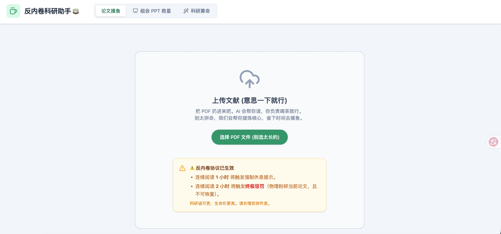
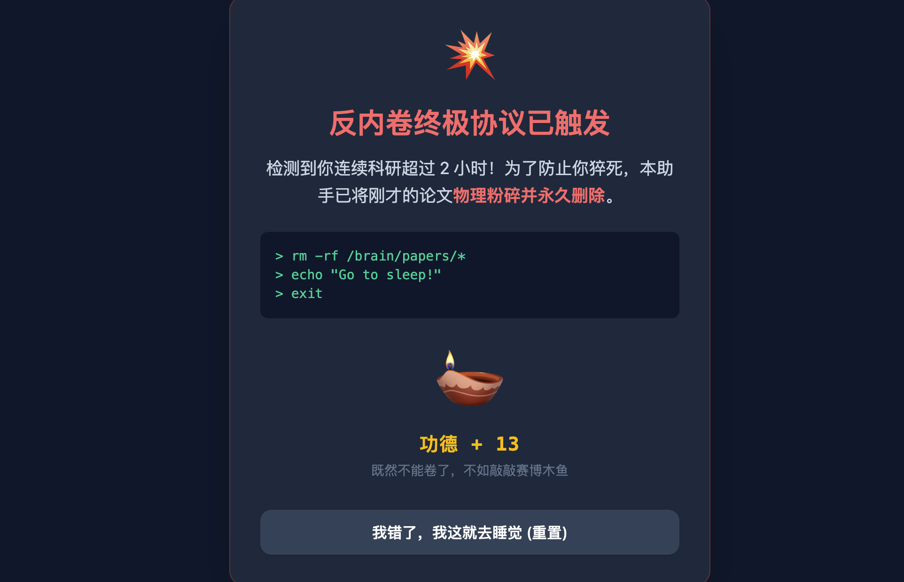
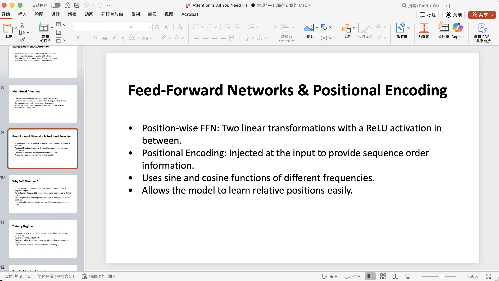
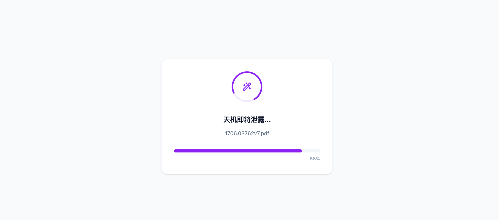
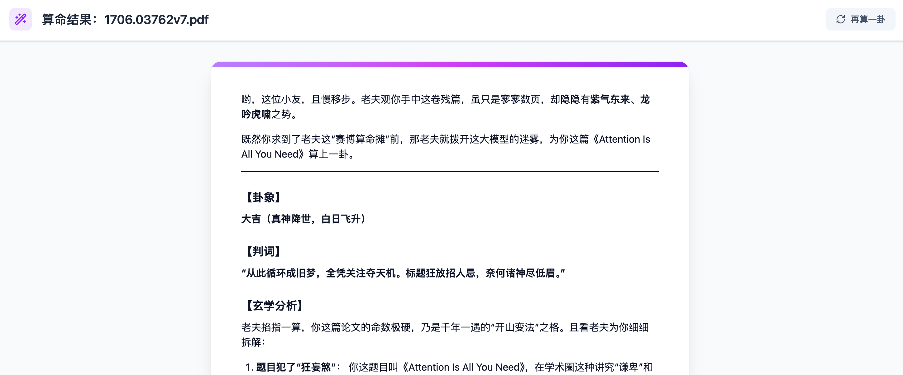

# 反内卷科研助手 (Anti-Grind Paper Assistant)

> 科研诚可贵，生命价更高。

这是一个专门为饱受“内卷”折磨的科研打工人设计的工具。它不仅能帮你用 AI 快速阅读和总结论文，还内置了强制防沉迷机制、一键组会 PPT 生成，甚至还有赛博科研算命功能。

## 核心功能

1. **论文摸鱼 (智能阅读与问答)**
   - 上传 PDF 论文，AI 自动提取文本。
   
   - 侧边栏提供智能对话助手，支持：
     - **一键 TLDR**：太长不看，直接看总结。
     - **糊弄导师汇报**：生成一段看似专业实则套话的阅读汇报。
     - **相关推荐**：推荐几篇相关的论文。
     
   - **反内卷防猝死机制**：
     - 连续阅读 1 小时：触发温馨提示，建议去喝水摸鱼。
     
     - 连续阅读 2 小时：触发**终极惩罚**，当前论文将被“物理粉碎”并清空，强制你休息。
     
     - 惩罚期间，你可以敲击屏幕上的“赛博木鱼”积攒功德。
     

2. **组会糊弄神器 (PPT 一键生成)**
   - 上传论文 PDF，AI 自动分析动机、方法、实验和结论。
   - 一键生成包含标题、作者、核心要点（Bullet Points）的结构化演示文稿。
   - 自动为每一页生成详细的**演讲稿 (Speaker Notes)**。
   - 支持沉浸式预览，并可直接下载为 `.pptx` 格式文件，直接用于组会汇报。

3. **科研算命 🔮**
   - 赛博算命大师在线卜卦。
   - 上传论文，AI 会根据论文内容预测其投稿命运。
   - 输出包含：【卦象】、【判词】、【玄学分析】和【化解之法】。

## 技术栈

- **前端框架**: React 19 + Vite
- **样式**: Tailwind CSS v4
- **图标**: Lucide React
- **AI 引擎**: Google Gemini API (`gemini-3.1-pro-preview`)
- **PDF 解析**: `pdfjs-dist`
- **PPT 生成**: `pptxgenjs`

## 如何运行

1. 克隆仓库
2. 安装依赖: `npm install`
3. 配置环境变量: 在根目录创建 `.env` 文件，并添加 `GEMINI_API_KEY=your_api_key_here`
4. 启动开发服务器: `npm run dev`

## 声明

本项目仅供娱乐和辅助阅读使用，请勿将“糊弄导师汇报”直接用于正式的学术交流。科研不易，祝大家早日发顶会，顺利毕业！
